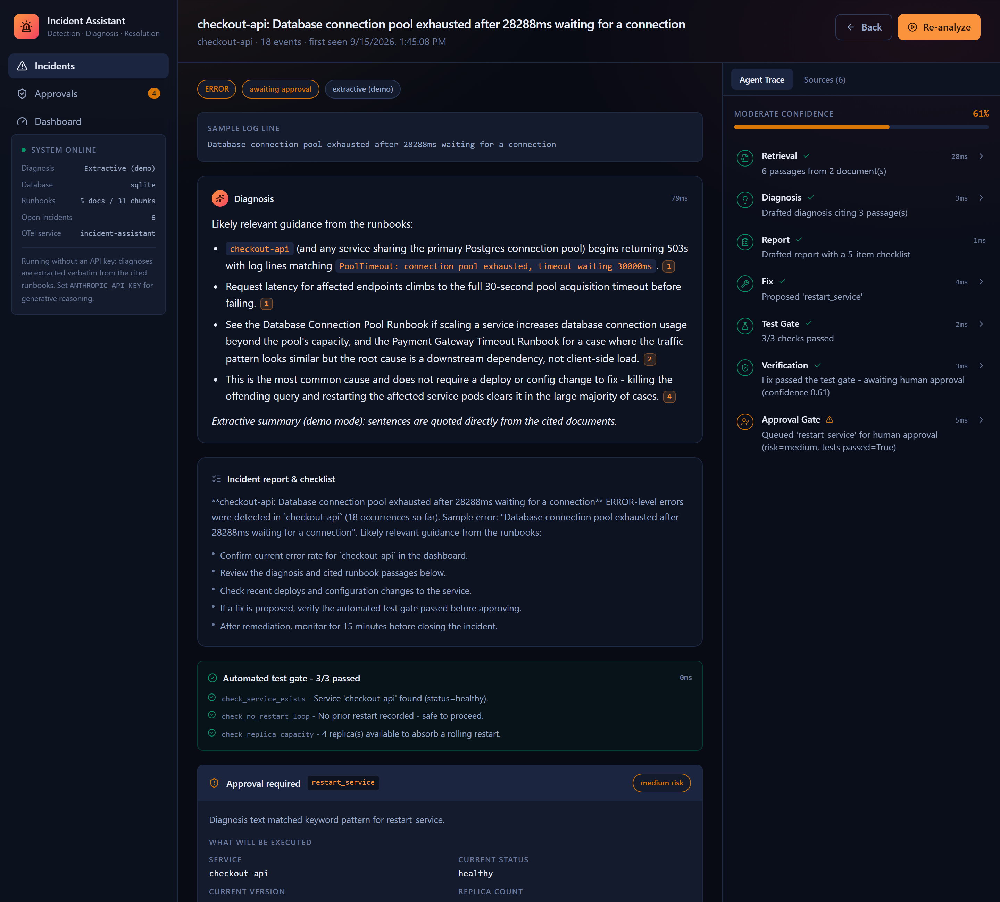
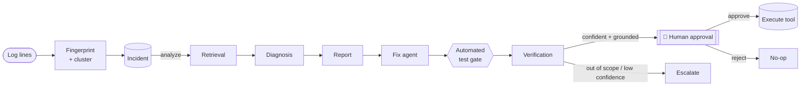
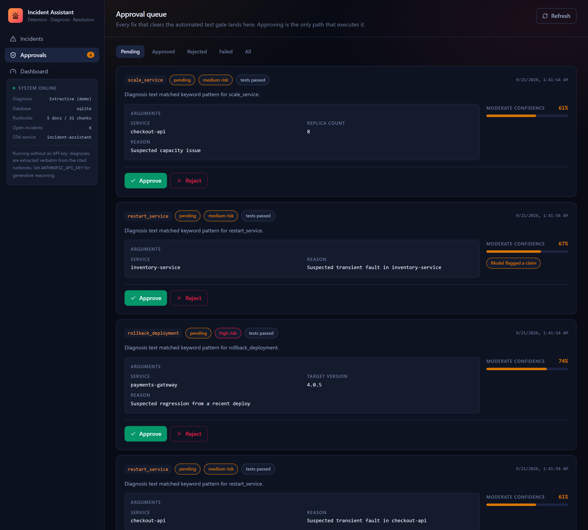
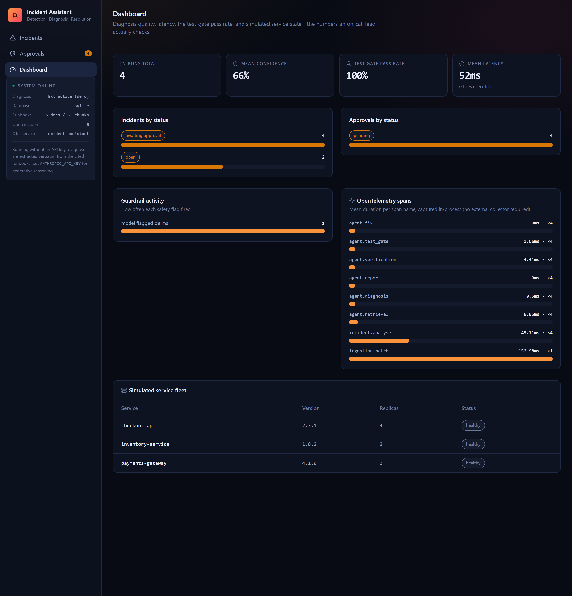

# AI-Powered Incident Detection & Resolution Assistant

A full-stack assistant that ingests application logs, clusters errors into
incidents, retrieves relevant runbooks and past incidents, has an LLM diagnose
the likely cause with citations, and proposes a remediation — but requires the
fix to pass an **automated test gate** *and* a **human approval** before it is
ever allowed to execute.

**[Live demo →](https://incident-assistant-zpg0.onrender.com)** &nbsp;·&nbsp;
[](https://render.com/deploy?repo=https://github.com/pardhu0201/incident-assistant)

Runs for free (Render's free web-service tier — sleeps after 15 minutes idle,
~50s to wake on the next request) in deterministic extractive mode with no API
key, and upgrades in place to Claude Opus 5 diagnosis when one is supplied.
Click **Deploy to Render** to spin up your own copy.



## Why this exists

A portfolio project demonstrating, with working and tested code, the parts of
an on-call assistant that separate a demo from something you'd actually trust
near production systems:

- **Deterministic incident clustering** — every error is fingerprinted
  (service + normalized message + top stack frame, BLAKE2b-hashed) and folded
  into an existing open incident within a time window, or opens a new one —
  no LLM in the clustering path to be non-reproducible about.
- **A 7-stage LangGraph pipeline** — retrieval → diagnosis → report → fix →
  test gate → verification → approval gate, with every stage wrapped in a real
  [OpenTelemetry](https://opentelemetry.io/) span (custom in-process exporter,
  zero external collector required).
- **Two independent safety nets before any fix is offered** — a named,
  independently-checkable **automated test gate** (e.g. "not already restarted
  in the last N minutes," "target version exists and differs from current,"
  "replica count within bounds") runs *in addition to*, not instead of, each
  tool's own live-data preflight check.
- **Verification that won't rubber-stamp a confident-sounding hallucination** —
  a deterministic groundedness score combines citation validity, IDF-weighted
  lexical support, and a query-coverage/BM25-relevance floor, so an
  out-of-scope error (nothing in the runbooks actually covers it) is capped at
  low confidence and escalated instead of auto-approved, no matter how fluent
  the LLM's answer reads.
- **A real, physical human-approval boundary** — the agent graph can only
  *propose* a fix (tool name + validated arguments + preflight preview);
  `execute()` is reachable only from a separate approvals service, only after
  a human decision, which re-validates and re-runs preflight immediately
  before acting.
- **Evaluation against a curated dataset, not vibes** — `backend/evals/` is a
  golden-set harness scoring clustering accuracy, retrieval quality, fix-tool
  accuracy, and — critically — whether an out-of-scope error was actually
  escalated rather than auto-approved. CI runs it on every push and fails on
  regression.

## Architecture



| Stage | What it does |
|---|---|
| **Ingest & cluster** | JSONL logs → fingerprint (service + normalized message + top stack frame) → fold into an open incident or create one |
| **Retrieval** | Hybrid BM25 + dense search over runbooks/past incidents, fused by normalised score + reciprocal rank |
| **Diagnosis & report** | Claude Opus 5 (or a strictly extractive fallback) identifies the cause with citations and drafts a report + checklist |
| **Fix proposal** | Deterministic keyword-pattern match to one of three ops tools, arguments filled from live service state |
| **Test gate** | Named, independently-checkable preconditions per tool — must pass before a human ever sees the proposal |
| **Verification** | Citation validity, lexical groundedness, and a relevance floor that caps confidence on out-of-scope errors |
| **Approval gate** | Persists the proposal for a human decision; the graph itself has no path to `execute()` |

Full design notes — the fingerprinting scheme, the verification scoring model,
the human-approval boundary, and the data model — are in
[`docs/ARCHITECTURE.md`](docs/ARCHITECTURE.md).

## Tech stack

| Layer | Choice |
|---|---|
| Agent orchestration | Python, **LangGraph** |
| LLM | **Claude Opus 5** (Anthropic API), optional — deterministic extractive fallback needs no key |
| API | **FastAPI**, Pydantic v2 |
| Retrieval | Hybrid BM25 + hashed embeddings (zero-dependency) |
| Observability | Real **OpenTelemetry** spans, custom in-process exporter, optional OTLP export |
| Database | SQLite (zero setup) or **PostgreSQL** — same code path either way |
| Frontend | **React 19**, TypeScript, Tailwind v4, Vite |
| Tests / evals | pytest (42 tests), a golden-set eval harness, ruff |
| CI/CD | GitHub Actions — lint, tests, evals, full Docker boot-and-healthcheck |
| Deployment | Single Docker image — free-tier ready on Render |

## Screenshots

| | |
|---|---|
|  |  |
| Every fix that clears the test gate lands here — approving is the only path that executes it. | Run/approval/incident counts, guardrail flag activity, and real per-span OpenTelemetry latency. |

## Quick start

### Docker (recommended)

```bash
git clone https://github.com/pardhu0201/incident-assistant.git
cd incident-assistant
docker build -t incident-assistant .
docker run -p 7860:7860 incident-assistant
# open http://localhost:7860
```

No environment variables required. Add `-e ANTHROPIC_API_KEY=sk-...` to
switch on Claude-generated diagnoses.

### Local dev (hot reload)

```bash
# Backend
cd backend
python -m venv .venv && .venv/Scripts/activate   # or source .venv/bin/activate
pip install -r requirements-dev.txt
uvicorn app.main:app --reload --port 8000

# Frontend (separate terminal)
cd frontend
npm install
npm run dev    # http://localhost:5173, proxies /api to :8000
```

Then use the UI's **Load sample logs** button on the Incidents page, or call
the API directly:

```bash
curl -X POST http://127.0.0.1:8000/api/logs/replay-sample
curl -X POST http://127.0.0.1:8000/api/incidents/1/analyze
```

### Tests and evaluation

```bash
cd backend
ruff check . && ruff format --check .
pytest -q                     # 42 tests: clustering, retrieval, tools, agent graph, API
python -m evals.run_eval      # clustering/retrieval/fix-accuracy/safety scorecard
```

### Docker Compose (with real Postgres)

```bash
docker compose up --build
```

Stands up the full stack against a real `postgres:17-alpine` service, so the
Postgres code path is genuinely exercised, not just SQLite.

## How the free demo works

With no `ANTHROPIC_API_KEY`, diagnosis runs in a deterministic, zero-cost
**extractive** mode: the diagnosis is built verbatim from the cited runbook
passages, so it is structurally incapable of stating a cause that isn't
written, word for word, in a cited document. Clustering, retrieval, the fix
agent, the test gate, verification, and the approval gate are **identical**
in both modes — supplying an API key swaps only the diagnosis step.

## Deploying for free

Full instructions are in [`docs/DEPLOYMENT.md`](docs/DEPLOYMENT.md) — one
click to Render's free tier via the bundled `render.yaml`, SQLite persisted on
the container disk, no database bill.

## Project layout

```
backend/
  app/
    agents/       # LangGraph nodes: retrieval, diagnosis, report, fix, test gate, verification, runner
    api/           # FastAPI routers
    db/             # SQLAlchemy models, session, init/seed
    ingestion/      # Log parsing, fingerprinting, clustering
    llm/            # Anthropic client wrapper + deterministic fallback
    rag/            # Hybrid retrieval (BM25 + hashed embeddings), verification helpers
    tools/          # Ops tool registry (validate / preflight / execute)
    telemetry/      # OpenTelemetry span exporter + context manager
  data/            # Sample logs + seed runbook corpus
  evals/           # Golden-set evaluation harness
  tests/           # 42 pytest tests
frontend/
  src/
    pages/          # Incidents, incident detail, approvals, dashboard
    components/     # Shared UI primitives
    lib/api.ts       # Typed API client
docs/              # architecture notes, deployment guide, screenshots
```

## License

MIT — see [LICENSE](LICENSE).
