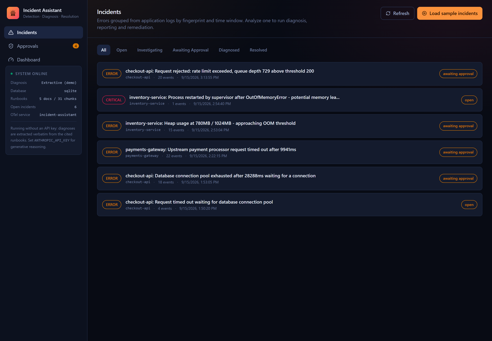

# AI-Powered Incident Detection & Resolution Assistant

A full-stack assistant that ingests application logs, clusters errors into incidents,
retrieves relevant runbooks and past incidents, has an LLM diagnose the likely cause
with citations, drafts an incident report, proposes a remediation - and requires the
fix to pass an automated test gate **and** a human approval before it ever executes.

**Live demo:** _add your Render URL here after deploying (see [docs/DEPLOYMENT.md](docs/DEPLOYMENT.md))_



## What it does

1. **Ingest** - JSONL application logs are parsed and stored (`POST /api/logs/ingest`,
   or `POST /api/logs/replay-sample` to load the bundled 327-line sample across three
   services).
2. **Detect & cluster** - every `ERROR`/`CRITICAL`/`FATAL` line is fingerprinted
   (service + normalized message + top stack frame, hashed) and folded into an existing
   open incident if a matching fingerprint occurred on the same service within the
   incident window, or opens a new one.
3. **Diagnose** - a 7-stage [LangGraph](https://github.com/langchain-ai/langgraph) pipeline
   (retrieval -> diagnosis -> report -> fix -> test gate -> verification -> approval gate)
   retrieves relevant runbook chunks and past incidents with hybrid BM25 + dense retrieval,
   has an LLM (or a deterministic extractive fallback with no API key) identify the likely
   cause with inline citations, and drafts an incident report and resolution checklist.
4. **Propose a fix, safely** - a rule-based fix agent maps the diagnosis to one of three
   ops tools (`restart_service`, `rollback_deployment`, `scale_service`). Every proposal
   must first clear an **automated test gate** (named, independently-checkable
   preconditions - e.g. "not already restarted in the last N minutes", "target version
   exists and differs from current", "replica count within bounds") before a human ever
   sees it.
5. **Verify** - a deterministic verification agent checks citation validity, citation
   coverage, lexical groundedness, and a query-coverage/BM25-relevance floor, so an
   out-of-scope error (nothing in the runbooks actually covers it) is never confidently
   auto-approved - it escalates instead.
6. **Approve, or don't** - a proposed fix that clears both gates lands in the approval
   queue. Only a human decision on that queue can trigger `execute()`; the agent graph
   itself has no path to it.
7. **Observe** - every pipeline stage is wrapped in a real [OpenTelemetry](https://opentelemetry.io/)
   span (custom in-process exporter, zero external collector required; point
   `OTEL_EXPORTER_OTLP_ENDPOINT` at a real backend to also export there). The dashboard
   aggregates run/approval/incident counts, per-span latency, guardrail flag activity, and
   a simulated 3-service fleet table.

## Architecture

See [docs/ARCHITECTURE.md](docs/ARCHITECTURE.md) for the full pipeline, data model, and
the human-approval safety design.

```
React (Vite) SPA  --->  FastAPI  --->  LangGraph agent pipeline  --->  SQLite / Postgres
                            |                                             |
                            +---------------- OpenTelemetry spans --------+
```

## Tech stack

Python · FastAPI · LangGraph · React · TypeScript · Tailwind CSS · SQLAlchemy ·
SQLite/PostgreSQL · OpenTelemetry · Docker

## Running locally

Requirements: Python 3.12+, Node 22+.

```bash
# Backend
cd backend
pip install -r requirements-dev.txt
cp ../.env.example ../.env   # optional - every value has a working default
uvicorn app.main:app --reload --port 8000

# Frontend (separate terminal)
cd frontend
npm install
npm run dev
```

Open the frontend dev server URL, then use the UI to **Load sample logs** on the
Incidents page, or call the API directly:

```bash
curl -X POST http://127.0.0.1:8000/api/logs/replay-sample
curl -X POST http://127.0.0.1:8000/api/incidents/1/analyze
```

With no `ANTHROPIC_API_KEY` set, diagnosis runs in a deterministic, zero-cost
"extractive demo" mode - the diagnosis is built verbatim from the cited runbook
passages, so the whole pipeline (retrieval, clustering, fix proposal, test gate,
verification, approval) is fully exercisable for free. Set `ANTHROPIC_API_KEY` in
`.env` to upgrade to Claude-generated diagnoses in place.

### Tests and evals

```bash
cd backend
ruff check . && ruff format --check .
pytest -q                       # 42 tests
python -m evals.run_eval         # golden-set regression gate (clustering, retrieval,
                                  # fix-tool accuracy, and the safety property that an
                                  # out-of-scope error must never be auto-approved)
```

### Docker

```bash
docker compose up --build
```

Runs the full stack (backend + built frontend + a real Postgres 17 service) in one
command - see [docker-compose.yml](docker-compose.yml).

## Deploying for free

See [docs/DEPLOYMENT.md](docs/DEPLOYMENT.md) - one click to Render's free tier via the
bundled `render.yaml`, SQLite persisted on the container disk, no database bill.

## API reference

Interactive docs are served at `/api/docs` (Swagger) and `/api/redoc` once running.
Key endpoints:

| Method | Path | Purpose |
|---|---|---|
| POST | `/api/logs/replay-sample` | Load the bundled sample dataset |
| POST | `/api/logs/ingest` | Ingest a batch of log events |
| GET | `/api/incidents` | List incidents |
| POST | `/api/incidents/{id}/analyze` | Run the agent pipeline on an incident |
| GET | `/api/runs/{id}/trace` | Full agent trace for a run |
| GET | `/api/approvals` | Approval queue |
| POST | `/api/approvals/{id}/decision` | Approve or reject a proposed fix |
| GET | `/api/dashboard` | Aggregated quality/latency/observability stats |
| GET | `/api/graph` | The agent pipeline topology |
| GET | `/api/health` | Health check |

## Project layout

```
backend/
  app/
    agents/       LangGraph nodes, graph wiring, prompts, runner
    api/          FastAPI routers
    db/           SQLAlchemy models, session, init/seed
    ingestion/    Log parsing, fingerprinting, clustering
    llm/          Anthropic client wrapper + deterministic fallback
    rag/          Hybrid retrieval (BM25 + hashed embeddings), verification helpers
    tools/        Ops tool registry (validate / preflight / execute)
    telemetry/    OpenTelemetry span exporter + context manager
  evals/          Golden-set regression harness
  tests/          pytest suite
  data/           Sample logs + seed runbook corpus
frontend/
  src/
    pages/        Incidents, incident detail, approvals, dashboard
    components/    Shared UI primitives
    lib/api.ts     Typed API client
docs/
  ARCHITECTURE.md
  DEPLOYMENT.md
  screenshots/
```

## License

[MIT](LICENSE)
